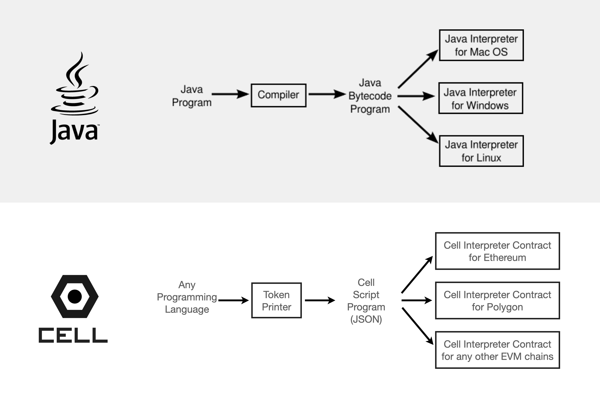

# C0.js

> JavaScript library for interacting with Cell C0 NFT contract

Cell is an NFT collection kit that lets you launch your own NFT collection with zero reliance on any 3rd party forever.


---

# Introduction

## 1. How Cell Works

Cell works like Java, but for NFTs.

- **BEFORE CELL:** Most NFT contracts have only ONE way of minting tokens into the contrac. This is because the minting logic is "compiled" into the smart contract code at deployment. This makes the NFT contract inflexible.
- **AFTER CELL:** Instead of hardcoding the minting logic on the NFT contract, Cell deploys **a virtual machine smart contract (named "C0")**, which has no collection specific logic on its own, but can dynamically interpret commands (called "Script") submitted for each token mint.



> **NOTE**
>
> Learn more about the Cell core technology here: https://cell.computer/#/?id=technology

### 1.1. Virtual machine

Instead of hardcoding the minting logic into the NFT contract, Cell deploys **a virtual machine smart contract (named "C0")**. This contract does not include any collection specific minting logic. The minting logic is supposed to be programmed offchain and submitted at mint time.

### 1.2. Script

The virtual machine's job is to interpret various signed commands submitted from offchain, and decide whether to mint them into onchain tokens or not.

These "signed commands" are called **"script"**.

---

## 2. What is a Script?

Before we go in, let's first define what a **script** is.

### 2.1. Schema

A token is a JSON file made up of the following attributes:

- `body`:
  - `cid`: the IPFS CID of the metadata that represents this token. The `id` and the `encoding` attributes can be deterministically derived from this attribute
  - `id`: tokenId (uint256) derived from the IPFS CID of the metadata
  - `encoding`
    - `0` if the IPFS encoding of the metadata CID was "raw" type. **Most NFT metadata will have an encoding of 0**.
    - `1` if the IPFS encoding of the metadata CID was "dag-pb" type
  - `sender`: who is allowed to submit this script to the blokchain to mint the token?
  - `receiver`: who will receive the token when it's minted? If not specified, whoever submits the sucessful transaction that mints this token will receive the token by default.
  - `value`: how much needed for minting this token? (in wei)
  - `start`: when does the minting start? (unix timestamp in seconds)
  - `end`: when does this token become invalid for minting? (unix timestamp in seconds)   
  - `royaltyReceiver`: royalty receiver for this token
  - `royaltyAmount`: royalty amount for this token (out of 1,000,000)
  - `merkleHash`: the merkle tree root hash of an address group allowed to mint
  - `puzzleHash`: this token can be minted only if the script submitter supplies a string that hashes to the `puzzleHash` (sha3)
  - `senders[]`: an array of addresses allowed to submit the script to the blockchain to mint the token (used to calculate `merkleHash`)
  - `owns[]`: an array of `Token` objects used to describe the NFTs you need to own to be able to mint, where the `Token` object has the following attributes:
    - `addr`: **(optional)** the NFT contract address. If not specified, it implies the current contract.
    - `id`: the tokenId of the NFT.
  - `burned[]`: an array of `Token` objects used to describe the NFTs you need to have burned in order to mint this token, where the `Token` object has the following attributes:
    - `addr`: **(optional)** the NFT contract address. If not specified, it implies the current contract.
    - `id`: the tokenId of the NFT.
  - `balance[]`: an array of `Token` objects used to describes how many tokens you need to own in order to mint this token, where the `Token` object has the following attributes:
    - `addr`: **(optional)** the contract address. It can either be an **ERC721 (Non Fungible Token)** or an **ERC20 (Fungible Token)** contract. If not specified, it implies the current contract.
    - `id`: the minimum required balance of the tokens you need to own for the contract.
      - **ERC721:** how many NFTs from the contract at `addr` you own, regardless of tokenId
      - **ERC20:** how many ERC20 tokens from the contract at `addr` you own
  - `signature`: the contract owner's signature of all other attributes included in the `body` attribute.
    - if `signature` is not included, it's an "unsigned token".
    - if `signature` is included, it's a "signed token".
- `domain`:
  - `name`: the name of the NFT contract
  - `chainId`: chainId (1 for Ethereum, 4 for rinkeby, etc.)
  - `verifyingContract`: the address of the NFT contract
  - `version`: "1" (it's always "1")

### 2.2. Phases

A tokens goes through multiple phases in its lifecycle.

1. **offchain:** Offchain scripts (which represent tokens) are NON-transferrable until they are settled on the blockchain.
    1. **unsigned:** unsigned scripts are tokens before authentication. these tokens can't be minted yet but includes all the information.
    2. **signed:** when an owner of a contract signs an unsigned script, it attaches a "signature" attribute to the script's body attribute. Then this script can now be minted onto the contract as an onchain token.
2. **onchain:** Once an offchain script is sent to the C0 onchain virtual machine, the C0 smart contract interprets the script to either mint it or reject it. Once minted, onchain tokens are transferrable over the host blockchain.

For a script to be minted to a contract, the **owner of the contract must always sign the token.** This can happen in various ways. Here are some example scenarios:

1. Owner publishes NFTs occasionally: The owner can sign their contract 
2. NFT collection drop: The owner can programmatically sign all tokens in the beginning
3. On-demand NFT minting app: The service provider may be the owner of a contract, and when a user wants to mint, the server may create and sign a token, and return it to the user, and the user can mint it from their browser.

### 2.3. Example

```json
{
  body: {
    cid: cid,
    id: id,
    raw: raw,                           // IPFS encoding (true if raw, false if dag-pb)
    sender: sender,                     // who is allowed to submit this script to the blokchain to mint the token?
    receiver: receiver,                 // who will receive the token when minted?
    value: value,                       // how much needed for minting this token? (in wei)
    start: start,                       // when does the minting start? (unix timestamp in seconds)
    end: end,                           // when does the minting end? (unix timestamp in seconds)   
    royaltyReceiver: royaltyReceiver    // royalty receiver for this token
    royaltyAmount: royaltyAmount        // royalty amount for this token (out of 1,000,000)
  },
  domain: {
    name: contract_name,
    chainId: chainId,
    verifyingContract: contract_address,
    version: "1"
  }
}
```

---

## 3. What does C0.js do?

C0.js is a JavaScript library that lets you:

### 3.1. Create a Script

Powered by Web3.js internally, C0.js is an easy-to-use JavaScript library that lets you build and sign scripts.

### 3.2. Send a Script to Blockchains

C0.js also lets you submit the signed scripts to the blockchain in order to mint them into onchain tokens

---

## 4. Script Workflow

### 4.1. Build

create an unsigned script by describing its information and the minting condition.

```javascript
await c0.token.build( . . . )
```

### 4.2. Sign

the contract owner signs an unsigned script. Once signed, it can be "sent" to the blockchain.

```javascript
await c0.token.sign( . . . )
```

### 4.3. Create

The Create action "builds" a script and then "signs" it, creating a signed script.

> **NOTE**
>
> In most cases you will just use this method instead of calling "build" and then "sign".

```javascript
await c0.token.create( . . . )
```


### 4.4. Send

send the signed script to the blockchain to mint it as an onchain token. The token now becomes transferrable.


```javascript
await c0.token.send( . . . )
```

---

# Install

## 1. node.js

First install the dependency

```
npm install c0js
```

Then require it in the app:

```javascript
const C0 = require('c0js')
```

## 2. browser

Import both `web3.js` and `c0.js`

```
<script src="https://cdnjs.cloudflare.com/ajax/libs/web3/1.7.1-rc.0/web3.min.js"></script>
<script src="https://unpkg.com/c0js/dist/c0.js"></script>
```

The global variable `C0` will be available once the script loads.

---

# API

## 1. core

### 1.1. init()

You need to initialize c0 first.

#### syntax

```javascript
await c0.init(initObject, force)
```

##### parameters

- `initObject`
  - `web3`: an initialized web3 object
  - `key`: **(optional)** private key hex string (only needed in non-browser setting)
- `force`: **(optional)** if `true`, initialize the `c0` instance even if it no key is provided AND it fails to discover a browser wallet. By default it's `false`.

##### return value

- none

#### examples

##### a. Browser

In the browser, the web3 object includes access to the web wallet, therefore we do not need to pass the `key` attribute. Just need to pass the initialized web3 object

```javascript
const web3 = new Web3(window.ethereum);
const c0 = new C0()
await c0.init({ web3: web3 })
```

##### b. Node.js

In a non-browser setting, there is no built-in wallet, so we need to pass in the `key` attribute.

```javascript
const { createAlchemyWeb3 } = require("@alch/alchemy-web3");
const web3 = createAlchemyWeb3("https://eth-mainnet.alchemyapi.io/v2/<your-alchemy-api-key>")
const c0 = new C0()
await c0.init({
  web3: web3,                       // web3 object
  key: key,                         // private key (hex string)
});
```

##### c. force initialize

sometimes you just want to initialize a c0 object just to make use of the C0 library features without having to connect to a wallet. In this case you can pass `force: true`.

Let's take a look at an example piece of code:

```javascript
const web3 = new Web3()
const c0 = new C0()
await c0.init({ web3: web3 })
```

This will throw an error if executed in node.js context because:

1. the `c0.init()` method didn't supply a key
2. because this is node.js, there is no browser wallet extension, so the `c0.init()` will fail to connect with an existing wallet.

To make sure the `c0.init()` succeeds without throwing an error, so you can use the `c0` object for various purposes that don't require a wallet connection, you simply need to pass `force: true`:

```javascript
const web3 = new Web3()
const c0 = new C0()
await c0.init({ web3: web3, force: true })
```

### 1.2. web3

the injected `web3` object

```javascript
const latest = await c0.web3.eth.getBlock("latest");
```

### 1.3. key

The private key hex string. 

- If you did not initialize c0 with a `key` attribute, this value will be `null`. Therefore in a browser, the `c0.key` will be null.
- If you initialized c0 with a `key` attribute, it will return the private key hex string you initialized with.


### 1.4. account

The logged-in account address

```javascript
const current_user = c0.account
console.log("logged in:", current_user)
```

---

## 2. token

### 2.1. build()

create an unsigned token (you can pass the result to "sign()" to create a signed token)

#### syntax

```javascript
const unsignedToken = await c0.token.build(description)
```

##### parameters

- `description`: has 2 attributes `body` and `domain` (both mandatory)
  - `body`:
    - `cid`: **(required)** the IPFS CID of the token metadata. This is the only mandatory attribute of the `body` attribute.
    - `sender`: specify a single sender who will submit the script to the contract. if not specified, anyone can submit.
    - `receiver`: specify a single receiver who will receive this token when it's minted. if not specified, whoever submits the successful minting transaction will receive the token.
    - `value`: specify the value required to submit the script. if not specified, free to submit and mint.
    - `start`: from when is this token valid?
      - if `start` is specified, the token cannot be minted to the host contract until that time.
      - if not specified, it's considered valid anytime, and can be minted to the contract anytime.
    - `end`: until when is this token valid?
      - if `end` is specified, trying to mint to the host contract after that time will fail.
      - if not specified, it's valid anytime, and can be minted to the contract anytime.
    - `royaltyReceiver`: the royalty receiver address of this token. whenever a sale is made, NFT marketplaces that follow the EIP-2981 NFT royalty standard will send royalty to this address.
    - `royaltyAmount`: the amount of royalty (out of 1,000,000) the `royaltyReceiver` will receive for each NFT sale.
      - for example, if set as `100,000`, the royalty is 100,000/1,000,000 = 10%.
    - `senders`: an array of addresses for which the submission of this script is allowed.
      - when you pass the `senders` array, the `build()` method automatically creates a merkle root of the list and includes it in the returned token as an attribute named `merkleHash`.
    - `puzzle`: a string that is required for minting.
      - when you pass thte `puzzle` attribute for the `build()` method, it creates a sha3 hash of the `puzzle` string and includes it in the returned token as an attribute named `puzzleHash`. The token DOES NOT include the original `puzzle` string.
      - anyone who can come up with the exact same string that hashes to the resulting `puzzleHash` can mint.
  - `domain`
    - `name`: the name of the NFT contract to mint to
    - `chainId`: the chainId of the host blockchain to mint to
    - `address`: the contract to mint to

##### return value

- `unsignedToken`: a script object (without a signature)

#### examples

##### 1. free mint

Let's create a token that can be minted by anyone for free, first come first served.

First, we assume that we already know the domain information. You can find the domain JSON for your contract at [cell.computer dashboard](https://cell.computer)

```javascript
let unsignedToken = await c0.token.build({
  body: { cid: cid, },
  domain: {
    name: "canvas",                                         // name of the contract
    chainId: 1,                                             // mainnet
    address: "0x6866ed9a183f491024692971a8f78b048fb6b89b"   // contract address
  }
})
```

##### 2. priced mint

Let's create a token that requires 1ETH payment for minting:

```javascript
let unsignedToken = await c0.token.build({
  body: {
    cid: cid,
    value: 10 ** 18                                         // 10^18wei => 1ETH
  },
  domain: {
    name: "canvas",                                         // name of the contract
    chainId: 1,                                             // mainnet
    address: "0x6866ed9a183f491024692971a8f78b048fb6b89b"   // contract address
  }
})
```

##### 3. anyone in the group can mint

sometimes you want to allow anyone from a group to mint a single token, first come first served basis.

The difference with the `sender` attribute is that the `sender` directly specifies a single address that can mint, whereas `senders` is an array, and anyone from this array can mint but only one will succeed. Here's an example:

```javascript
let signedToken = await c0.token.create({
  body: {
    cid: cid,
    senders: [
      address0,
      address1,
      address2
    ]
  },
  domain: {
    address: "0x701facAd49e0349Ad5b782A2A785Db705fC265E4",
    name: "My NFT",
    chainId: "MNFT"
  },
})
```


### 2.2. sign()

#### syntax

```javascript
const signedToken = await c0.token.sign(unsignedToken)
```

##### parameters

- `unsignedToken`: unsigned token created with `build()`, which contains the attributes `"body"` and `"domain"`.

##### return value

- `signedToken`: exactly the same as `unsignedToken`, except that it now also contains a `signature` under `body.signature`


#### examples

In this example, let's create a token with a metadata of `cid` and then sign it:

```javascript
let unsignedToken = await c0.token.build({
  body: { cid: cid, },
  domain: {
    name: "canvas",                                         // name of the contract
    chainId: 1,                                             // mainnet
    address: "0x6866ed9a183f491024692971a8f78b048fb6b89b"   // contract address
  }
})
let signedToken = await c0.token.sign(unsignedToken)
```

### 2.3. create()

the `create()` method builds an unsigned token and signs and returns the signed token in a single function call.

#### syntax

```javascript
let signedToken = await c0.token.create(description)
```

##### parameters

- `description`: the same `description` object as the `build()` method.

##### return value

- `signedToken`: fully signed token


#### examples

We saw above that we can build an unsigned token and then sign it to get the signed token, like this:

```javascript
let unsignedToken = await c0.token.build({
  body: { cid: cid, },
  domain: {
    name: "canvas",                                         // name of the contract
    chainId: 1,                                             // mainnet
    address: "0x6866ed9a183f491024692971a8f78b048fb6b89b"   // contract address
  }
})
let signedToken = await c0.token.sign(unsignedToken)
```

With `create()` we can merge the two into one `create()` call:

```javascript
let signedToken = await c0.token.create({
  body: { cid: cid, },
  domain: {
    name: "canvas",                                         // name of the contract
    chainId: 1,                                             // mainnet
    address: "0x6866ed9a183f491024692971a8f78b048fb6b89b"   // contract address
  }
})
```

### 2.4. signer()

Takes a signed token and returns the original signer who created the `body.signature` attribute.

#### syntax

```javascript
let signer = await c0.token.signer(token)
```

##### parameters

- `token`: a **signed** token object

##### return value

- `signer`
  - if the token is a **signed token**
    - The address of the account that signed the token and created the signature at `token.body.signature`
  - if the token is NOT a **signed token**
    - `null`

#### examples

```javascript
let token = await c0.token.create({
  cid: cid
})
let signer = await c0.token.signer(token)
console.log("expected signer = ", c0.account)
console.log("actual signer = ", signer
```

### 2.5. send()

put a signed token on the blockchain by sending a transaction

#### syntax

```javascript
let tx = await c0.token.send(signedTokens, proofs, options)
```

##### parameters

- `signedTokens`: **(required)** An array of signed tokens, each created by calling `create()` (or by calling `build()` and then `sign()`)
- `proofs`: An array of proofs for the tokens. Only needed when at least one of the `signedTokens` has a `puzzleHash` attribute. You can leave as empty if your mint does not make use of the `puzzle` feature. A proof currently supports one type of attribute:
  - `puzzle`: The solution to the hash puzzle. This must hash to the same hash as the `token.body.puzzleHash` for the token to successfully mint.
- `options`: In case you want to customize the options used for sending the transaction (https://web3js.readthedocs.io/en/v1.2.11/web3-eth-contract.html#id33)

##### return value

- `tx`: the transaction object is returned after the mint transaction goes through.

where:

#### examples

##### 1. minting a single token

If there's only one token, you should wrap it inside an array:

```javascript
// Create a token
let signedToken = await c0.token.create({
  body: { cid: cid, },
  domain: {
    name: "canvas",                                         // name of the contract
    chainId: 1,                                             // mainnet
    address: "0x6866ed9a183f491024692971a8f78b048fb6b89b"   // contract address
  }
})
let tx = await c0.token.send([signedToken])
```

##### 2. minting multiple tokens

you can also mint multiple tokens in one transaction:

```javascript
// Create token 1
let signedToken1 = await c0.token.create({
  body: { cid: cid, },
  domain: {
    name: "canvas",                                         // name of the contract
    chainId: 1,                                             // mainnet
    address: "0x6866ed9a183f491024692971a8f78b048fb6b89b"   // contract address
  }
})
// Create token 2
let signedToken2 = await c0.token.create({
  body: { cid: cid2, },
  domain: {
    name: "canvas",                                         // name of the contract
    chainId: 1,                                             // mainnet
    address: "0x6866ed9a183f491024692971a8f78b048fb6b89b"   // contract address
  }
})
// Mint the tokens
let tx = await c0.token.send([signedToken1, signedToken2])
```

##### 3. hash puzzle gated mint

A token can be created such that only the person who knows the original string that hashes to a 

```javascript
// Create a hash puzzle protected token
let token = await c0.token.create({
  body: {
    cid: cid,
    puzzle: "top secret"
  },
  domain: {
    name: "canvas",                                         // name of the contract
    chainId: 1,                                             // mainnet
    address: "0x6866ed9a183f491024692971a8f78b048fb6b89b"   // contract address
  }
})
// Mint the hash puzzle protected token by providing the solution
let tx = await c0.token.send(
  [token],
  [{ puzzle: "top secret" }]
)
```

##### 4. multiple tokens with hash puzzle

Sometimes you have multiple tokens, and only one of them is hash-locked.

In this case you will still need to provide the `proofs` array. Some of this array's elements will be `null` because they don't require puzzle solutions to mint. Here's an example:

```javascript
// Create a free token
let token1 = await c0.token.create({
  body: {
    cid: cid,
  },
  domain: {
    name: "canvas",                                         // name of the contract
    chainId: 1,                                             // mainnet
    address: "0x6866ed9a183f491024692971a8f78b048fb6b89b"   // contract address
  }
})
// Create a hash locked token
let token2 = await c0.token.create({
  body: {
    cid: cid,
    puzzle: "top secret"
  },
  domain: {
    name: "canvas",                                         // name of the contract
    chainId: 1,                                             // mainnet
    address: "0x6866ed9a183f491024692971a8f78b048fb6b89b"   // contract address
  }
})
// Mint the hash puzzle protected token by providing the solution
let tx = await c0.token.send(
  [token1, token2],
  [null, { puzzle: "top secret" }]
)
```

Note that the first item of the `proofs` array is `null` since the `token1` doesn't require any hash puzzle answer to mint.

---


### 2.6. burn()

The `burn()` function lets you burn tokens so they can no longer be transferred.

#### syntax

Takes an `address`, automatically initializes a contract interface for the address, and returns the [web3 contract.methods interface](https://web3js.readthedocs.io/en/v1.2.11/web3-eth-contract.html#id26).

```javascript
const tx = await c0.token.burn(address, tokenIds)
```

##### parameters

- `address`: the contract address
- `tokenIds`: an array of tokenIds to burn. You must own all of them, otherwise the transaction will fail.

##### return value

- `tx`: the transaction receipt

#### examples

```javascript
const tx = await c0.token.burn(
  "0x51f814dc24174c0b9a4cffaddeb16b4cdb439841",                                     // the contract address
  ["39131010058045797349567233885970132483291053977504436574875345706679852652030"] // tokenId to delete
)
```


---


### 2.7. methods()

The `methods()` function lets you access the low level web3 contract methods in all platforms (browser & node.js).

#### syntax

Takes an `address`, automatically initializes a contract interface for the address, and returns the [web3 contract.methods interface](https://web3js.readthedocs.io/en/v1.2.11/web3-eth-contract.html#id26).

```javascript
const contract_methods = c0.token.methods(address)
```

##### parameters

- `address` the contract address

##### return value

- `contract_methods`: the corresponding contract methods interface

#### examples


##### 1. tokenURI()

```javascript
const contract_methods = c0.token.methods(address)
let tokenURI = await contract_methods.tokenURI(tokenId).call()
```

##### 2. ownerOf()

```javascript
const contract_methods = c0.token.methods(address)
let owner = await contract_methods.ownerOf(tokenId).call()
```


---

## 3. gift

### 3.1. create()

The `gift.create()` method is used to create a gift package. 

> **NOTE**
>
> The create() method only CREATES a gift, it does NOT actually give it to the receiver on the blockchain. To give a gift onchain, you must first create a gift using gift.create() and then pass it to the gift.send() method to send it to the blockchain.

#### syntax

```javascript
const gift = await c0.gift.create(description)
```

##### parameters

- `description`: The gift description
  - `body`: the gift body
    - `cid`: **(required)** the token metadata IPFS CID
    - `receiver`: **(required)** the intended receiver address of this gift
    - `royaltyReceiver`: the royalty receiver address once the token is minted on the blockchain
    - `royaltyAmount`: the royalty amount (out of 1,000,000) for the `royaltyReceiver`
  - `domain`: the domain for which the gift is valid
    - `address`: the contract address
    - `chainId`: the chainId of the host blockchain

##### return value

- `gift`: the gift object. A gift object can be directly submitted to the blockchain to be minted as an onchain token. A gift object is made up of 2 attributes:
  - `body`: the gift body object, which includes the following attributes:
    - `cid`: the IPFS CID of the token metadata
    - `id`: the tokenId (derived from the IPFS CID of the token metadata)
    - `encoding`: is the metadata encoded in "raw" format or "dag-pb"?
      - `0` if the IPFS encoding of the metadata CID was "raw" type. **Most NFT metadata will have an encoding of 0**.
      - `1` if the IPFS encoding of the metadata CID was "dag-pb" type
    - `receiver`: the receiver address
    - `royaltyReceiver`: the royalty receiver address
    - `royaltyAmount`: the royalty share amount for the royalty receiver.
  - `domain`: the context in which the token is valid. The domain must contain at least the two following attributes:
    - `verifyingContract`: the contract address
    - `chainId`: the chainId of the host contract (1 for mainnet, 4 for rinkeby, etc.)

#### examples

##### 1. a simple gift

The following code creates a token that points to a JSON metadata file at `ipfs://bafkreicwqno6pzrospmpufqigjj6dn7ylo7si5reajybci22n55evjgv7y`, which can only be sent to the receiver `0x502b2FE7Cc3488fcfF2E16158615AF87b4Ab5C41`:

```javascript
const gift = await c0.gift.create({
  cid: "bafkreicwqno6pzrospmpufqigjj6dn7ylo7si5reajybci22n55evjgv7y",
  receiver: "0x502b2FE7Cc3488fcfF2E16158615AF87b4Ab5C41"
})
```

##### 2. a gift with royalty attached

The following code creates the same gift but with a royalty attached.


```javascript
const gift = await c0.gift.create({
  cid: "bafkreicwqno6pzrospmpufqigjj6dn7ylo7si5reajybci22n55evjgv7y",
  receiver: "0x502b2FE7Cc3488fcfF2E16158615AF87b4Ab5C41",
  royaltyReceiver: "0x502b2FE7Cc3488fcfF2E16158615AF87b4Ab5C41",
  royaltyAmount: 10 ** 5  // 10^5 out of 10^6 is 10% royalty
})
```

Things to note:

1. `receiver: "0x502b2FE7Cc3488fcfF2E16158615AF87b4Ab5C41"`: This gift can only go to the address 0x502b2FE7Cc3488fcfF2E16158615AF87b4Ab5C41
2. `royaltyReceiver: "0x502b2FE7Cc3488fcfF2E16158615AF87b4Ab5C41"`: The royalty receiver is the same as the token receiver in this case. But you could also set it as someone else.
3. `royaltyAmount: 10 ** 5` is 10% of the 1,000,000, so the royalty percentage is 10%

### 3.2. send()

The `send()` method actually "gives" a constructed token to the receiver by broadcasting to the blockchain.

> NOTE
>
> The `send()` method can ONLY be called by the OWNER of the NFT contract.

#### syntax

```javascript
const tx = await c0.gift.send(gifts)
```

##### parameters

- `gifts`: an array of gift items constructed by `gift()`. Each constructed gift object contains the 2 attributes:
  - `body`: The gift body objct with the following attributes:
    - `id`: tokenId (uint256) derived from the IPFS CID of the metadata
    - `raw`
      - `0` if the IPFS encoding of the metadata CID was "raw" type. **Most NFT metadata will have an encoding of 0**.
      - `1` if the IPFS encoding of the metadata CID was "dag-pb" type
    - `receiver`: the receiver of the gift
    - `royaltyReceiver`: royalty receiver for this token
    - `royaltyAmount`: royalty amount for this token (out of 1,000,000)
  - `domain`: the context in which the token is valid. The domain must contain at least the two following attributes:
    - `verifyingContract`: the contract address
    - `chainId`: the chainId of the host contract (1 for mainnet, 4 for rinkeby, etc.)

##### return value

- `tx`: the web3 transaction object after the transaction goes through

#### examples

##### 1. simple gifting

Let's create a simple gift token and give it to someone

```javascript
const gift = await c0.gift.create({
  body: {
    cid: "bafkreicwqno6pzrospmpufqigjj6dn7ylo7si5reajybci22n55evjgv7y",
    receiver: "0x502b2FE7Cc3488fcfF2E16158615AF87b4Ab5C41"
  },
  domain: {
    chainId: 1,                                             // mainnet
    address: "0x6866ed9a183f491024692971a8f78b048fb6b89b"   // contract address
  }
})
const tx = await c0.gift.send([gift])
```

##### 2. gifting multiple tokens

Let's create multiple tokens and gift them:

```javascript
// Create gift1
const gift1 = await c0.gift.create({
  body: {
    cid: "bafkreicwqno6pzrospmpufqigjj6dn7ylo7si5reajybci22n55evjgv7y",
    receiver: "0x502b2FE7Cc3488fcfF2E16158615AF87b4Ab5C41"
  },
  domain: {
    chainId: 1,                                             // mainnet
    address: "0x6866ed9a183f491024692971a8f78b048fb6b89b"   // contract address
  }
})
// Create gift2
const gift2 = await c0.gift.create({
  body: {
    cid: "bafkreia3xjsrgbayzwm37hxvtg5o7vj6lrwmiidsjiorl5jiqykwo4jema",
    receiver: "0x502b2FE7Cc3488fcfF2E16158615AF87b4Ab5C41"
  },
  domain: {
    chainId: 1,                                             // mainnet
    address: "0x6866ed9a183f491024692971a8f78b048fb6b89b"   // contract address
  }
})
// Send the gifts
const tx = await c0.gift.send([gift1, gift2])
```


---

## 4. collection

### 4.1. create()

#### how cell collections work

Before we go in, let's quickly go through how the contracts are created and deployed with Cell.

Normally you don't know what your contract address will be until you deploy it. However with Cell, your contract addresses are deterministically generated, meaning **you know what all of your future contract addresses will be EVEN BEFORE you deploy them.**

This has many benefits:

1. **no 3rd party reliance:** just from your own wallet address you can figure out all your NFT contract addresses, without having to rely on an RPC provider
2. **scalability:** not relying on RPC means you can create contracts without worrying about infra.
3. many more...

So how does it work? Let's say you have an address A. Then you can some function `generate()` like this:

- `generate(addressA, 0)`: generate 0th contract address for addressA
- `generate(addressA, 1)`: generate 1st contract address for addressA
- `generate(addressA, 2)`: generate 2nd contract address for addressA
- ...

Now that we understood how it's supposed to work, let's look at the syntax. Each collection create method will need the `index` so it can deploy the contract at that slot.


#### syntax

deploy a cell contract

```javascript
const tx = await c0.collection.create(info, options)
```

##### parameters

- `info`: describes the contract information
  - `factory`: the factory contract address. you can use the following addresses:
    - Ethereum mainnet: `0x468342E4dECa1B34b3a1524E23e7f97fC31eE402`
    - Rinkeby testnet: `0xbAfC33dDC111D11b2CDC2dA0004B5514E92Aa4E4`
  - `index`: the contract index (recommended to create from 0, 1, 2, ...)
  - `name`: the NFT contract name
  - `symbol`: the NFT contract symbol
- `options`: (optional) in case you want to customize the options used for sending the transaction (https://web3js.readthedocs.io/en/v1.2.11/web3-eth-contract.html#id33)


##### return value

- `tx`: the web3 transaction object after the transaction goes through.

#### examples

##### 1. First deployment

Let's say this is your first time and you want to deploy a new NFT contract:

- with the name "My first NFT contract"
- with the symbol "FIRST"
- to Ethereum mainnet

Since this is your first time, you can use your "contract #0" (index 0) to deploy:

```javascript
const tx = await c0.collection.create({
  factory: "0x468342E4dECa1B34b3a1524E23e7f97fC31eE402" // this is the mainnet factory
  index: 0,
  name: "My first NFT contract",
  symbol: "FIRST"
})
```

##### 2. Second deployment

If you wanted to deploy another one, the `index: 0` won't work anymore since it's already been deployed. You will need to enter `index: 1`:  

```javascript
const tx = await c0.collection.create({
  factory: "0x468342E4dECa1B34b3a1524E23e7f97fC31eE402" // this is the mainnet factory
  index: 1,
  name: "My second NFT contract",
  symbol: "SECOND"
})
```

Of course, you can enter any other index (such as 420, 10000, etc.) as long as you haven't used them yet.

But then it will be hard for you to manage all your collections since you won't easily know which index is available. It is recommended that you keep incrementing the index as you deploy more contracts.

### 4.2. find()

As explained in the ["how cell collections work"](#how-cell-collections-work) section, every address has a pre-determined set of contract addresses even before the contracts are deployed.

This makes it easy to manage all your collections in one place WITHOUT having to rely on some 3rd party API or an RPC provider.

With Cell, **instead of querying an API to fetch your contract addresses**, you can locally **compute the contract addresses**, even when you're offline.

And this is exactly what `collection.find()` method does.

>
> **Note**
>
> The find() method DOES NOT use any RPC or API and therefore does not require a network connection. It's a simple function that **calculates** contract addresses from any creator account.

Here's the syntax:

#### syntax


```javascript
const collections = await c0.collection.find(query)
```

##### parameters

- `query`: describes the condition to search for
  - `factory`: the factory contract address
    - Ethereum mainnet: `0x468342E4dECa1B34b3a1524E23e7f97fC31eE402`
    - Rinkeby testnet: `0xbAfC33dDC111D11b2CDC2dA0004B5514E92Aa4E4`
  - `implementation`: the implementation contract address
    - Ethereum mainnet: `0x9f6AEe303FD26c9d561597560B3e6B0E91118dB3`
    - Rinkeby testnet: `0x9265953CbA4747111051e47021520eDEEa456d7e`
  - `creator`: the creator address. can be anyone's address.
  - `start`: the contract start index to filter from (within the creator's namespace)
  - `count`: the number of results to return

##### return value

- `collections`: an array of contract addresses that match the condition


#### examples

##### 1. get the first 100 collections

This example returns the first 100 collections (from index 0 to index 99) for the account `0x502b2FE7Cc3488fcfF2E16158615AF87b4Ab5C41`:

```javascript
const collections = await c0.collection.find({
  factory: "0x468342E4dECa1B34b3a1524E23e7f97fC31eE402",          // mainnet factory
  implementation: "0x9f6AEe303FD26c9d561597560B3e6B0E91118dB3",   // mainnet implementation
  creator: "0x502b2FE7Cc3488fcfF2E16158615AF87b4Ab5C41"
  start: 0,
  count: 100
})
```

##### 2. dynamic query

sometimes you may want to automatically detect the user's account and find that user's collections:

```javascript
const account = c0.account;     // currently logged-in user is stored at c0.account
const collections = await c0.collection.find({
  factory: "0x468342E4dECa1B34b3a1524E23e7f97fC31eE402",          // mainnet factory
  implementation: "0x9f6AEe303FD26c9d561597560B3e6B0E91118dB3",   // mainnet implementation
  creator: account,                                               // current account
  start: 0,
  count: 100
})
```


---

## 5. util

A utility module that includes convenience methods

### 5.1. cid()

compute the IPFS CID of any data WITHOUT storing to IPFS.

#### syntax

```javascript
const cid = await c0.util.cid(data)
```

##### parameters

- `data`: can be of the following types:
  - `Uint8Array`
  - `ArrayBuffer`
  - `Blob`
  - `Buffer`
  - `ReadableStream`
  - `String`
  - `Object`: Any JSON. Will be deterministically stringified before calculating the CID

##### return value

- `cid`: the computed IPFS cid for the data

#### examples

##### 1. Calculate CID for a String

```javascript
const svg = `<svg xmlns="http://www.w3.org/2000/svg" viewBox="0 0 576 512"><!-- Font Awesome Free 5.15.4 by @fontawesome - https://fontawesome.com License - https://fontawesome.com/license/free (Icons: CC BY 4.0, Fonts: SIL OFL 1.1, Code: MIT License) --><path d="M528 32H48C21.5 32 0 53.5 0 80v352c0 26.5 21.5 48 48 48h480c26.5 0 48-21.5 48-48V80c0-26.5-21.5-48-48-48zm-352 96c35.3 0 64 28.7 64 64s-28.7 64-64 64-64-28.7-64-64 28.7-64 64-64zm112 236.8c0 10.6-10 19.2-22.4 19.2H86.4C74 384 64 375.4 64 364.8v-19.2c0-31.8 30.1-57.6 67.2-57.6h5c12.3 5.1 25.7 8 39.8 8s27.6-2.9 39.8-8h5c37.1 0 67.2 25.8 67.2 57.6v19.2zM512 312c0 4.4-3.6 8-8 8H360c-4.4 0-8-3.6-8-8v-16c0-4.4 3.6-8 8-8h144c4.4 0 8 3.6 8 8v16zm0-64c0 4.4-3.6 8-8 8H360c-4.4 0-8-3.6-8-8v-16c0-4.4 3.6-8 8-8h144c4.4 0 8 3.6 8 8v16zm0-64c0 4.4-3.6 8-8 8H360c-4.4 0-8-3.6-8-8v-16c0-4.4 3.6-8 8-8h144c4.4 0 8 3.6 8 8v16z"/></svg>`
const cid = await c0.util.cid(svg)
```

##### 2. Calculate CID for a JSON Object

```javascript
const metadata = {
  name: "test NFT",
  description: "blablaH',
  image: "ipfs://bafy"
}
const cid = await c0.util.cid(metadata)
```

##### 3. Calculate CID for a Buffer object

```javascript
const image = await fs.promises.readFile("favicon.ico")
const cid = await c0.util.cid(image)
```


### 5.2. verify()

Given a `token.body` object or a `gift` object, verify the overall structure is valid when submitted to the blockchain.

3. checks that the `id` attribute exists
4. checks that the `encoding` attribute exists
5. checks that the `cid` attribute exists
6. checks the `id` and `encoding` against the `cid` attribute to make sure they are equivalent.

#### syntax

```javascript
let isvalid = c0.util.verify(body, verbose)
```

##### parameters

- `body`: A data object that contains the following attributes:
  - `cid`: the IPFS CID
  - `id`: the UINT256 tokenId derived from the `cid`
  - `encoding`: the encoding (`0` for raw encoding, `1` for dag-pb encoding) used by the `cid`, also can be derived from the `cid`
- `verbose`: **(optional)** if set to `true`, will throw an exception when invalid, instead of returning `false`.

The `body` can be one of the following:

1. The `body` attribute of a `token` constructed with `c0.token.build()` or `c0.token.create()`
2. A `gift` object constructed with `c0.token.gift()`

##### return value

- if valid
  - returns `true`
- if invalid
  - if `verbose` is true
    - throws an error with a corresponding error message
  - if `verbose` is not specified or false
    - returns `false`

#### examples

##### verify a token

```javascript
const token = await c0.token.create({ cid: cid })
let isvalid = c0.util.verify(token.body)
if (isvalid) {
  let tx = await c0.token.send([token])
} else {
  alert("token is invalid")
}
```

##### verify a gift

```javascript
const gift = await c0.token.gift({
  cid: cid,
  receiver: "0x63316d4221263496201c3a20b36Cdda9c0249574"
})
let isvalid = c0.util.verify(gift)
if (isvalid) {
  let tx = await c0.token.gift([gift], domain)
} else {
  alert("token is invalid")
}
```

### 5.3. solve()

Solve a puzzle locally to make sure the solution is correct, without having to call the `send()` method.

#### syntax

```javascript
let isvalid = c0.util.solve(body, solution)
```

##### parameters

- `body`: The token body. must include a non empty `puzzleHash` value
- `solution`: The solution object. currently only supports one attribute: `puzzle`
  - `puzzle`: string that you think will hash to match the `body.tokenHash`

##### return value

- `isvalid`
  - `true` if the solution actually hashes to the `body.tokenHash`
  - `false` if the solution does NOT hash to match the `body.tokenHash`

#### examples

```javascript
let token = await c0.token.crete({
  cid: cid,
  puzzle: "this is the top secret solution"
})

// attempt0 will be "false"
let attempt0 = c0.util.solve(token.body, {
  puzzle: "wrong solution"
})

// attempt1 will be "true"
let attempt1 = c0.util.solve(token.body, {
  puzzle: "this is the top secret solution"
})
```
